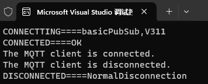

# AwsIotMqttConnectTest

A sample shows how to connect AWS Iot with MQTTnet.

## Preparation

- AWS IOT Endpoint - Get from your AWS console.
- Device certificate - Download from your AWS console.
- Device private key - Download from your AWS console.
- Root certificate - Download from https://www.amazontrust.com/repository/AmazonRootCA1.pem. 

## Result

