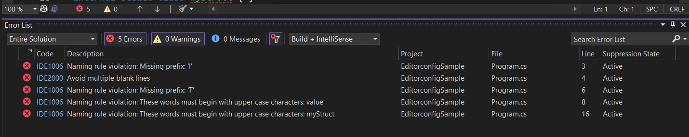

# EditorconfigSample

A sample to show how to combine `.editorconfig` with dotnet Analyzers.

## Important things in csproj

```xml
  <PropertyGroup>
    ....

    <!-- Important!!!!! Add those properties -->    
	<EnforceCodeStyleInBuild>true</EnforceCodeStyleInBuild>
    <EnableNETAnalyzers>true</EnableNETAnalyzers>
    <AnalysisLevel>latest</AnalysisLevel>
    <AnalysisMode>Default</AnalysisMode>
    
  </PropertyGroup>
```

## Result

When run `dotnet build` or build in vs, you may get the following result:

